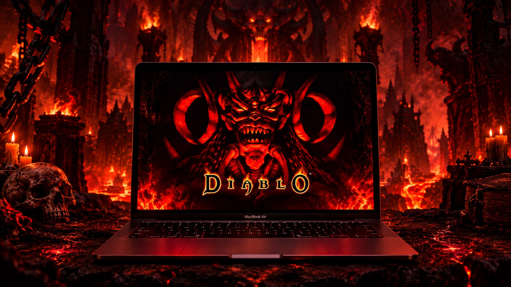

# Diablo 1 · 4K · macOS



**Классическая Diablo (1996) и дополнение Hellfire — нативно на macOS, в 4K/5K, полностью на русском и с HD-текстурами.**
**Classic Diablo (1996) + Hellfire running natively on macOS in 4K/5K, fully in Russian, with upscaled HD textures.**

### 🇷🇺 Что это за проект

Оригинальная Diablo создавалась под 640×480 и Windows 95. Здесь мы делаем из неё современную игру для Mac, сохраняя дух оригинала:

- 🍎 **Нативно на macOS.** Обычное `.app` для Intel и Apple Silicon, без эмуляторов, Wine и виртуальных машин. В основе открытый движок [DevilutionX](https://github.com/diasurgical/DevilutionX).
- 🖥️ **4K и 5K на Retina.** Чёткая картинка без мыла с целочисленным масштабированием. Интерфейс растягивается на весь экран, есть зум карты кнопками сбоку.
- 🧠 **HD-текстуры.** Оригинальная графика увеличивается нейросетью (Topaz, Real-ESRGAN) до 4×, плюс сглаживающие фильтры и апскейл в реальном времени, как DLSS. HD-пак собирается **локально из вашей копии игры** специальными скриптами: графику Blizzard мы не распространяем.
- 🇷🇺 **Полностью на русском.** Интерфейс, предметы, квесты, диалоги и русская озвучка.
- 🏃 **Удобства.** Бег героя в подземельях и другие улучшения в духе оригинала.

Чтобы играть, нужна **своя копия** Diablo + Hellfire (например, с [GOG](https://www.gog.com/game/diablo)). Файлы игры в репозиторий не входят.

### 🇬🇧 What is this

A macOS-first fork of the open-source DevilutionX engine:
- a native Mac app (Intel and Apple Silicon);
- crisp 4K/5K Retina output with UI scaling and map zoom;
- AI-upscaled HD textures, generated locally from **your own** game files;
- a full Russian localization with voice-over;
- quality-of-life features such as running in dungeons.

You need to own the original game. No game assets are included.

## Goals

| Feature | Status |
|---|---|
| Native macOS build (CLT only, all deps vendored, no Homebrew) | ✅ works |
| Retina / 5K resolution list with integer-scale hints (upstream bug #4348) | ✅ works (`patches/0001`) |
| Run in dungeons (single-player, **J** toggles) | ✅ works (`patches/0002`) |
| Multi-level world zoom, with on-screen buttons on the side | 📝 designed |
| UI scaling: the interface fills the screen | 📝 designed |
| Pixel-art post-filters (Scale2x / MMPX) | 📝 planned |
| GPU real-time upscaling ("DLSS-like": FSR1 / MetalFX) | 🔬 research |
| HD texture packs (AI-upscaled), built locally from your own game files | 🔬 in development |
| Full Russian version (UI, texts, voice) | ✅ via DevilutionX `ru` + official `ru.mpq` voice pack |

## Build (macOS)

You need the Xcode Command Line Tools (`xcode-select --install`) and CMake 3.22 or newer. For translations, including the Russian UI, you also need gettext: `brew install gettext`.

```bash
./scripts/build.sh                    # -> build/devilutionx.app
./scripts/run.sh --profile 1080p-x3   # run in 1920x1080, x3 on a 5K Retina iMac
```

Display profiles live in `config/` (`./scripts/run.sh --list`). Details, tests and the patch workflow: [docs/BUILDING-macOS.md](docs/BUILDING-macOS.md).

## Game data

Copy `DIABDAT.MPQ` (and, for Hellfire, `hellfire.mpq`, `hfmonk.mpq`, `hfmusic.mpq`, `hfvoice.mpq`) from **your own** copy of the game into:

```
~/Library/Application Support/diasurgical/devilution/
```

The GOG installer can be unpacked on a Mac with `innoextract` (`brew install innoextract`), without running it. See `scripts/install-gog-data.sh`.

For Russian text set `[Language] Code=ru` in `diablo.ini`. For Russian voices, also put DevilutionX's official [`ru.mpq`](https://github.com/diasurgical/devilutionx-assets/releases) in the same folder.

## Repository layout

- `devilutionx/` — engine source: DevilutionX at the commit in `UPSTREAM_COMMIT`, without files for other platforms (`scripts/prune-list.txt`), plus this fork's changes. It is generated by `scripts/sync-upstream.sh`; every engine change is also kept as a patch in `patches/`, so `scripts/sync-upstream.sh --check` stays green.
- `patches/` — this fork's engine changes as patches against upstream, applied in order.
- `scripts/` — build, run, sync and data helpers.
- `config/` — display profiles (`diablo.ini` fragments) for `scripts/run.sh`.
- `docs/` — documentation, e.g. [BUILDING-macOS.md](docs/BUILDING-macOS.md).
- `NOTICE.md` — third-party components and their licenses.
- `MODIFICATIONS.md` — list of changes made in this fork.
- `CLAUDE.md` / `AGENTS.md` — rules for AI coding agents working on this repo.

## Credits, license, disclaimer

- Engine: **DevilutionX** by the diasurgical team and contributors. This fork is based on their work.
- License: **Sustainable Use License v1.0** (see `LICENSE.md`). Use and distribution are free of charge and non-commercial only. This fork is modified; see `MODIFICATIONS.md`.
- Third-party libraries fetched at build time keep their own licenses; see `NOTICE.md`.
- Not affiliated with, endorsed by, or connected to Blizzard Entertainment or the DevilutionX project. *Diablo* and *Hellfire* are trademarks of their respective owners.
- **No game assets are included or will be accepted** (MPQs, extracted or upscaled art, audio, saves).
